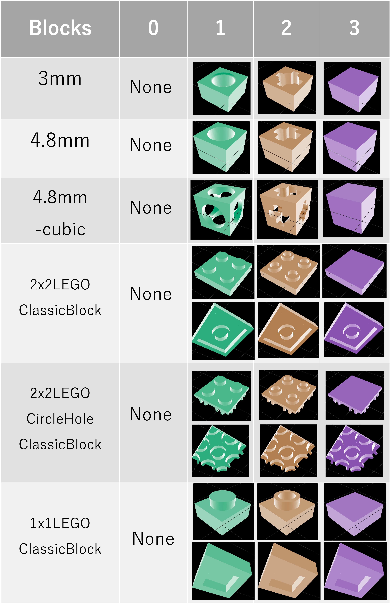

# 先にお読みください。
このソフトウェアは個人的に作られたプログラムです。 当ソフトウェアによって作成された成果物と互換する製品の製造者との関係は一切ございません。また、当ソフトウェアおよび当ソフトウェアにより作成された成果物に起因するいかなる賠償要求や損失に対し、当ソフトウェアの作者はその責任を一切負わないものとします。

当ソフトウェアのライセンスはPyQtを使用している都合から[GPLv3ライセンス](LICENSE)に準拠します。

# ProtoLotus
穴を等間隔に開けた工作用プレートの3Dデータ(STLファイル)を自作できるソフトウェアです。
現在はネジ止め等に有効な3 mm穴とデンマークの某有名ブロックと互換する4.8 mm穴が作成できます。

# 実行方法(ユーザー向け。バイナリから実行します)
現状だとmacOSとwindowsに対応しています。

### 動作確認OS

```
macOS: macOS Monterey version 12.4
windows: windows10 home x64
```

### 配布リンク

下記リンクからprotolotus_mac_\[version\].zip/protolotus_windows_\[version\].zipをDL&解凍してからご使用ください。

- 最新版: https://github.com/henjin0/ProtoLotus/releases

- windows他バージョン: https://drive.google.com/drive/folders/1lRnMViTJTnGBnZArAat9tUMsmL3bNGBV?usp=sharing

- macOS他バージョン: https://drive.google.com/drive/folders/12MCWW9YqUyiiJXNIK2_rq5YSsvzvNvHh?usp=sharing

### macOS版の注意

アプリの取得元不明で実行できないため、アプリを実行して実行できない旨のメッセージを表示した後に**システム環境設定>セキュリティとプライバシー**から設定を許可してください。


### windows版の注意

「危害を及ぼす可能性～」という警告が出てきますが、無視して継続してDLしてください。


### バイナリファイル名
```
mac: protolotus.app
windows: protolotus.exe
```

# 実行方法(pythonから)
```shell:version
Python 3.9.1
pip 22.1.2 
```

pullしたパッケージ中でpython -m venv \[仮想環境名\]を実行し、仮想環境を先につくってください。作成した仮想環境に入ったあとに下記コマンドでpythonパッケージをインストールしてください。
インストールできない場合にはpip3 install -U pipを実行してpipをアップデートしてください。

```shell:install
pip3 install -U pip
pip3 install -r requirements.txt
```

その後、下記コマンドでmain.pyを実行するとソフトウェアが立ち上がります。
```shell:install
python main.py
```

# バイナリのビルド方法
事前に上記の実行方法(pythonから)を実施してください。

本プログラムでは.uiファイルは直接使っておらず、.pyファイルへ変換する必要があります。
画面を作成した場合は下記コマンドを参考に.uiファイルを.pyファイルを変換してください。
（venv環境を適用していればコマンドが使用できる。）

```shell:make_ui
pyuic6 ui_files/MainWindow.ui -o ui_files/MainWindow.py
```

最後に下記コマンドを実行することでdistフォルダにバイナリファイル(main.app or main.exe)を作成することができます。

```shell:build
pyinstaller main.spec  
```

なお、pyenv使用時にはpyinstallerでエラーが発生する場合がある。その場合には下記コマンドを実行してpython 3.9.1をオプション付きで再インストールしてからpyinstall main.spacを実行する。

```shell:option
PYTHON_CONFIGURE_OPTS="--enable-shared" pyenv install 3.9.1
```

# 操作方法


# 配置できるブロックの種類


# 技術資料や今後の動向
気分次第で更新します。
https://checkered-shallot-238.notion.site/Protolotus-51c786ba7c704fd1af3fa8878840d783

# LICENSE
Please read [LICENSE](LICENSE).
